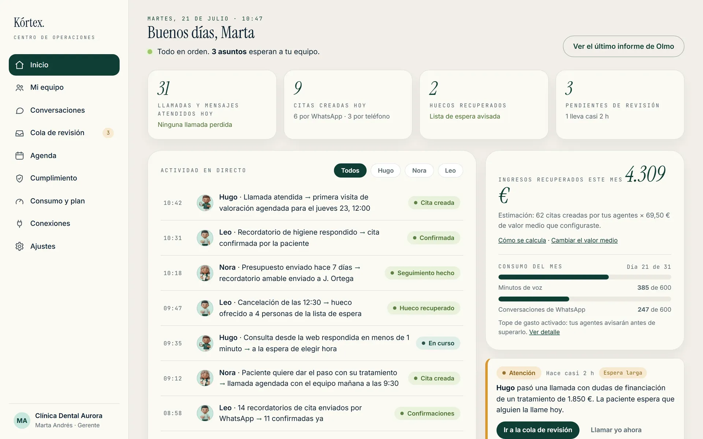
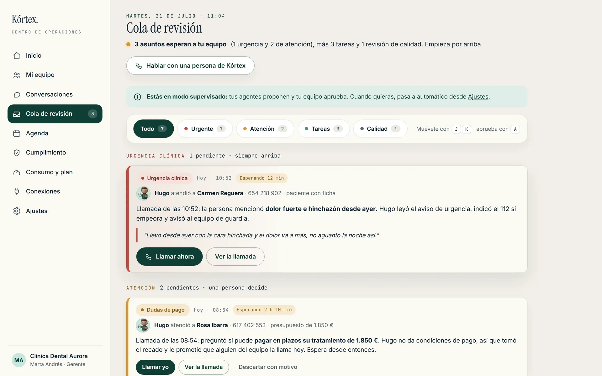
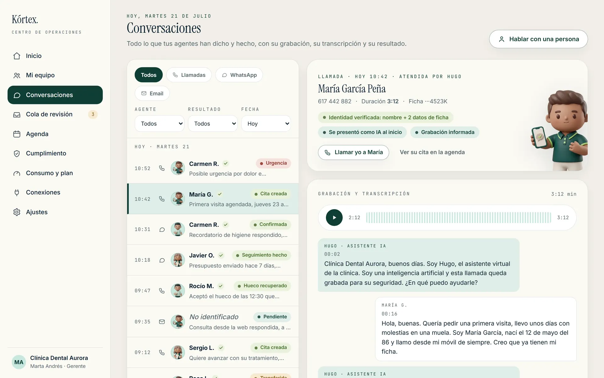
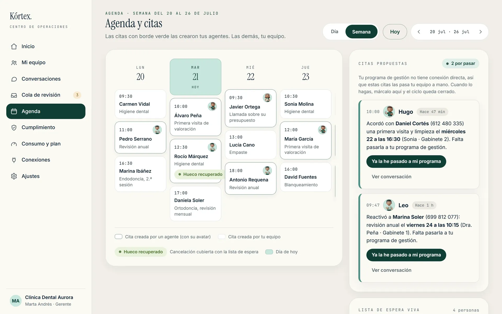
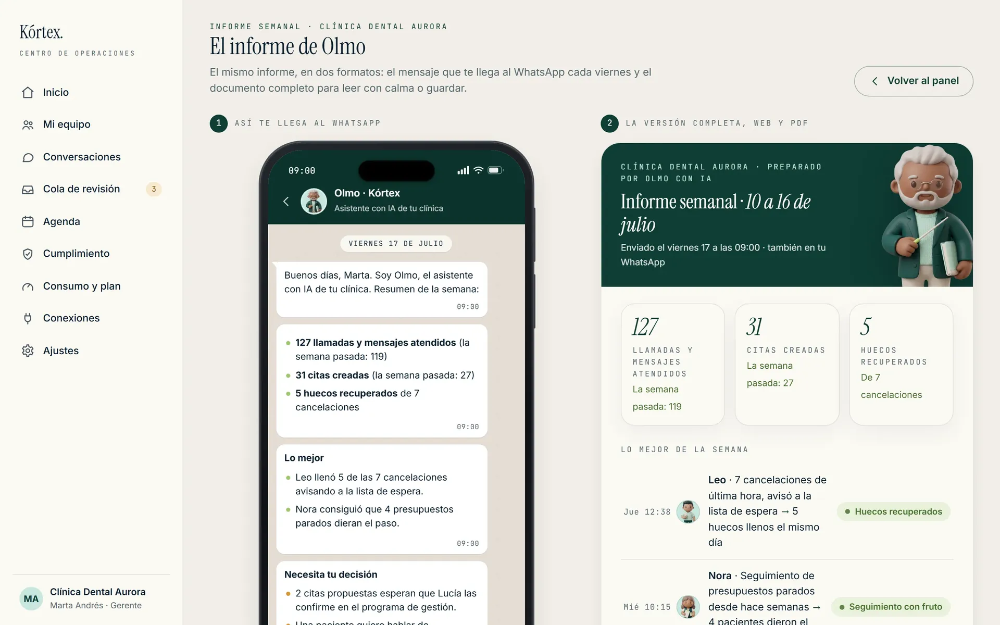

# Kórtex Mission Control

**The operations platform for AI agent teams in healthcare clinics.**

Kórtex installs and operates AI agents for Spanish healthcare centers (radiology and diagnostic imaging, radiotherapy, dental, aesthetic medicine, nursing homes). Each agent has a name, a face and a single mission: answering every phone call, keeping the calendar tight, chasing no-shows, handling WhatsApp and email, and caring for the clinic's online reputation.

**Mission Control** is the SaaS panel where clinic staff see and steer everything their agents do. This repository documents its design and development.

> **Status: in active development · ~63% complete**
> `██████████████████░░░░░░░░░░` 63%

---

## What the panel does

A clinic manager opens Mission Control in the morning and sees, at a glance:

- **Live activity feed**: every call answered, appointment created, reminder confirmed and gap recovered, timestamped and attributed to the agent that did it.
- **Review queue**: anything delicate (a payment doubt, an upset patient, an edge case outside the script) is never decided by an agent. It waits for a human, with full context attached.
- **Recovered revenue**: an honest estimation of what the agents brought back this month, with the formula visible and editable.
- **Consumption and caps**: voice minutes and WhatsApp conversations used, with spending caps and alerts so there are never surprises.
- **Compliance room**: every action traceable and exportable. Agents always introduce themselves as AI assistants; escalation to a human is one tap away.

### More screens

| Review queue | Conversation detail |
|---|---|
|  |  |

| Calendar | Weekly report |
|---|---|
|  |  |

The full set of **23 high-fidelity screens** lives in [`screens/`](screens/) as self-contained HTML built on the Kórtex design system (`kortex-ds.css`): access, home, review queue, conversations, team, onboarding, calendar, integrations, consumption, compliance, agent configuration, clinic settings, users and roles, notifications, system states, first-day experience, and vertical-specific homes for dental clinics, nursing homes and diagnostic imaging.

---

## Agent architecture

Each agent is an independent, single-mission worker orchestrated around the clinic's existing tools. No rip-and-replace: agents work on top of the calendar, phone number and WhatsApp the clinic already has.

| Agent | Mission | Core stack |
|---|---|---|
| **Voice** | Answers every call 24/7, resolves routine matters, books appointments, warm-transfers anything delicate | Telnyx Voice AI (EU-resident stack) + premium TTS |
| **Calendar** | Creates, moves and cancels appointments on the clinic's real calendar, with clinic rules (rooms, equipment, timings) | Google Calendar / Microsoft Graph / Cal.com, orchestrated with n8n |
| **Reminders** | Confirms appointments, rescues no-shows, refills freed slots from the waiting list | WhatsApp Business Cloud API (utility templates) + SMS fallback |
| **WhatsApp** | Handles the clinic's WhatsApp line: logistics, directions, preparation instructions, new bookings | WhatsApp Business Cloud API + LLM |
| **Email** | Triages the front-desk inbox, answers the routine, drafts the rest for human review | IMAP / Microsoft Graph + LLM |
| **Reviews** | Replies to every Google review with judgement, requests reviews at the right moment | Google Business Profile API, human-approved queue |

**Design principles**

1. **Humans decide.** Agents execute the repetitive; anything clinical or delicate escalates to staff. There is no autonomous clinical decision anywhere in the system.
2. **EU data residency by design.** Voice, inference and storage run on providers with EU-resident infrastructure, under data processing agreements. Agents only ever touch appointment logistics, never medical records.
3. **Traceability as a feature.** Every action is logged with time, actor and outcome, and the log is exportable. Compliance (including EU AI Act transparency duties) is a product surface, not a footnote.
4. **One engine, many verticals.** The same core serves dental clinics, imaging centers, radiotherapy departments and nursing homes through configuration, not forks.

## Technology

- **LLM layer**: large language models with structured outputs and strict, per-agent action allowlists; EU-resident inference endpoints for anything touching patient-adjacent data.
- **Voice**: Telnyx Voice AI (EU stack: carrier, GPUs and storage in Europe) with premium neural TTS for natural Castilian Spanish.
- **Messaging**: WhatsApp Business Cloud API (Meta), utility templates only, plus SMS fallback via Spanish routes.
- **Orchestration**: n8n as the workflow backbone connecting voice, calendars, messaging and the panel.
- **Panel front end**: token-based design system (`kortex-ds.css`), semantic HTML prototypes, WCAG-conscious contrast, responsive from 360px up.

## Roadmap

- [x] Product design: 23 high-fidelity screens across 4 verticals
- [x] Design system with brand tokens and accessibility pass
- [x] Agent service architecture and EU-resident provider selection
- [ ] Panel application build (in progress · 63%)
- [ ] Live pilot with founding clinics
- [ ] Self-service onboarding

## About

Kórtex is built by [VaultBit](https://github.com/vaultbit-web), a Spanish software engineering studio focused on AI agents and security. Website: [kortexagents.com](https://www.kortexagents.com).

**All rights reserved.** This repository is a portfolio showcase; the design system, screens and brand assets are proprietary and may not be reused without written permission.
